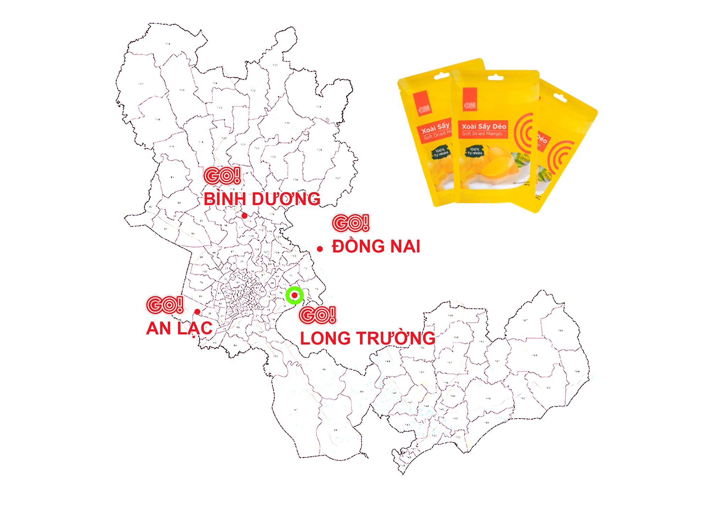
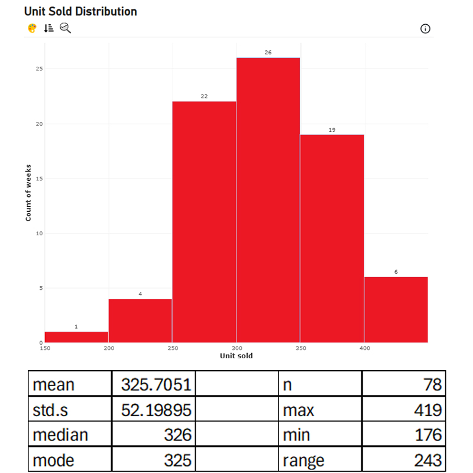

# INVENTORY PLANNING & NETWORK OPTIMIZATION: GO! Dried Mango 250G Case Study

## Project Overview
This project focuses on the Sales and Operations Planning (S&OP) for Central Retail in Vietnam, specifically for the launch of a new hypermarket, **GO! LONG TRUONG**, scheduled to open in July 2026  
The study centers on a high-performing FMCG product: **GO! Dried Mango (250G)**  
The primary objective is to develop a strong inventory and logistics strategy for the first six months of operation (July–December 2026) to meet service level targets while minimizing costs and stockout risks

## Problem Statement
Central Retail aims to optimize the supply chain for its new location by answering three key questions:
1. What are the required **safety stock**, and stock levels to maintain a **90% service level**? The target unit sold weekly is **greater than 300**, is that true?
2. Can we accurately **forecast demand** using historical data from comparable stores?
3. Which logistics network (Direct vs. Non-direct via a 3PL warehouse) **minimizes total costs**?

## Data Methodology
Historical data from December 2023 to December 2025 was collected from three comparable hypermarkets in the Ho Chi Minh City area: GO! AN LAC, GO! BINH DUONG, and GO! DONG NAI  
Data cleaning and processing were performed using PCS DW and Power Query to handle variables such as unit sales, promotions, and seasonality

## Key Analysis Phases
**1. Descriptive Analysis (Inventory Planning)**  
- **Safety Stock:** The average of unit sold in HCMC area is from 316 to 335 units per week, so safety stock in this area is 335 units weekly
- **Stock meet 90% service level:** Analysis determined that to meet a 90% service level, each hypermarket should maintain approximately 393 available items per week
- **Demand Estimation:** The average weekly sales in the HCMC area range between 240 and 412 units
- **Hypothesis Testing:** Using a T-test, it was confirmed (p-value < 0.05) that average weekly sales exceed 300 units per store

**2. Predictive Analysis (Demand Forecasting)**  
A demand planning model was developed using Ordinary Least Squares (OLS) Regression  
*Key Features:* The model utilizes stock_available, promotion_binary, rolling_mean_4, and momentum as significant predictors  
*Performance:* The model explains approximately **37%** of weekly sales variance with an average **MAPE (Mean Absolute Percentage Error) of 17.02%**  

**3. Prescriptive Analysis (Network Optimization)**  
The project compared two logistics models for five southern suppliers:  
*Direct Logistics:* Suppliers shipping directly to hypermarkets (Total Cost: **VND 31.247 million/month**)  

*Non-direct Logistics:* Utilizing a 3PL warehouse in Thu Duc City (Total Cost: **VND 28.705 million/month**)  

**Conclusion:** The Non-direct Logistics model was selected as it is 9% more cost-effective than the direct method

## Tools Used
- Data Extraction: PCS DW
- Data Transformation: Power Query
- Statistical Analysis: Descriptive Statistics, T-test, OLS Regression
- Optimization: Excel Solver (Linear Programming for logistics)

# Results
By implementing the suggested S&OP plan, GO! LONG TRUONG can expect to maintain high service levels with an optimized safety stock of 335-393 units while reducing monthly logistics expenditure by 9% through a centralized warehouse strategy.
